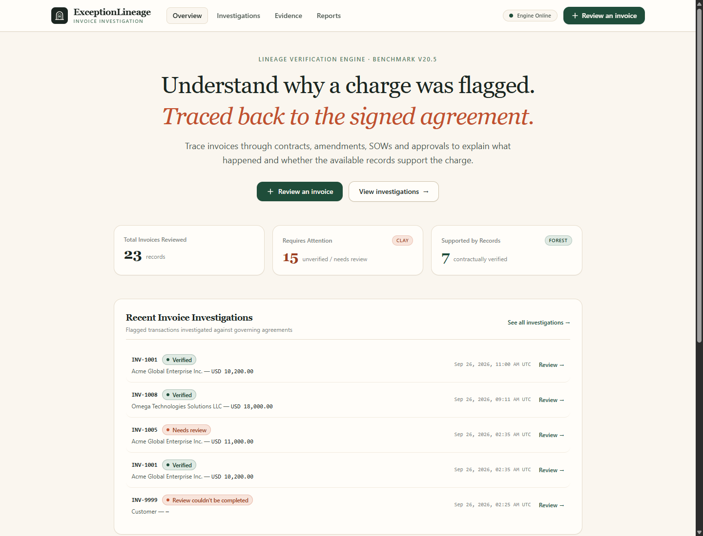
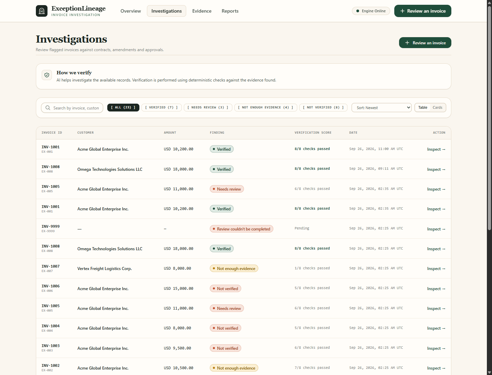
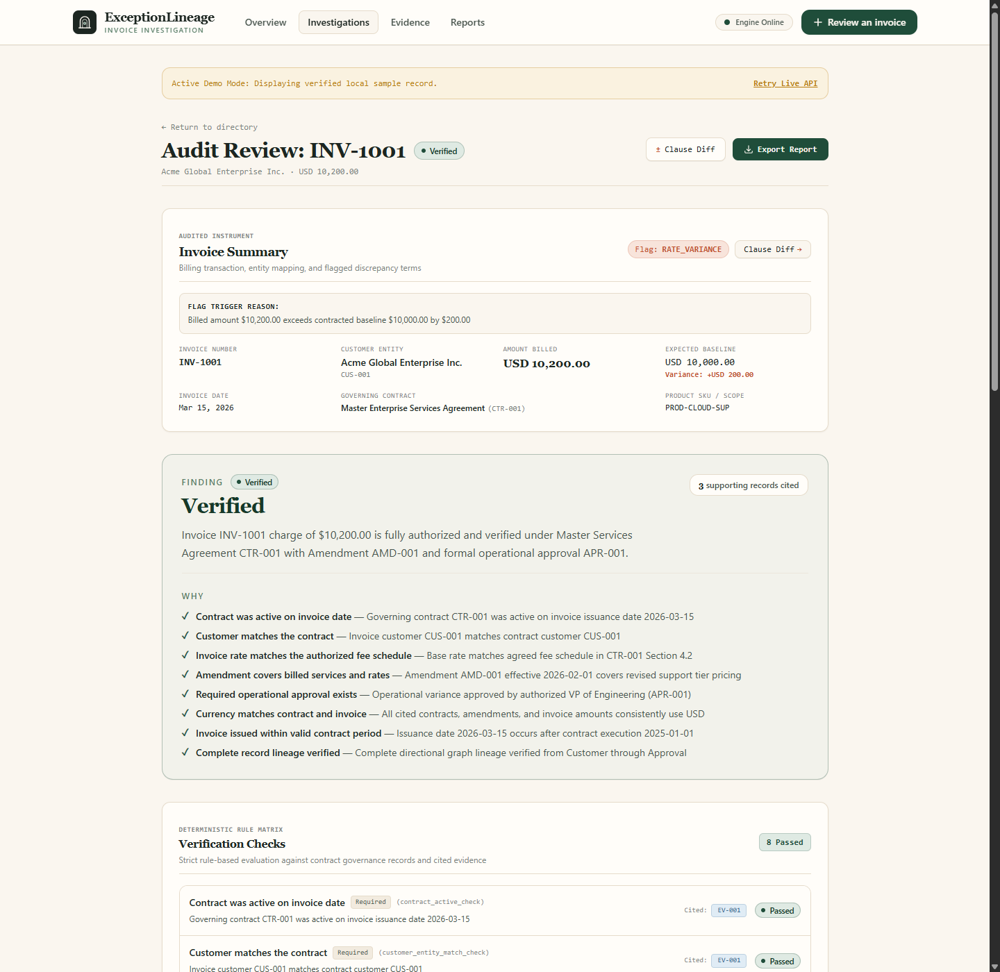

# ExceptionLineage

Evidence-backed investigation system for enterprise transaction exceptions.

## Overview

ExceptionLineage investigates relationships across contracts, amendments, SOWs, approvals and invoices to produce evidence-backed determinations for enterprise transaction exceptions.

## User Interface

ExceptionLineage features an editorial, calm, and audit-grade interface designed with classical typography, architectural brand linework, and fine edges.

### Overview & Activity Ledger


### Investigations Directory
*Searchable directory with real-time status filter pills, multi-parameter sorting, and dense ledger view.*


### Investigation Workspace & Lineage Pedigree
*Side-by-side contract vs billed discrepancy terms, deterministic check matrix, and interactive governance graph.*


## Project Structure

```
ExceptionLineage/
├── apps/
│   ├── web/          # Next.js frontend (TypeScript + Tailwind CSS)
│   └── api/          # FastAPI backend (Python)
├── data/             # Seed records, cases, and evaluation ground truth
├── evaluation/       # Quantitative evaluation harness & reporting (Stage 18)
│   ├── adapters/     # Baseline evaluation adapters (Deterministic, Heuristic, LLM)
│   ├── reports/      # Machine-readable JSON and human-readable Markdown reports
│   ├── dataset.py    # Controlled dataset and scenario loader
│   ├── metrics.py    # Transparent accuracy, recall, tool, and failure formulas
│   ├── runner.py     # CLI evaluation runner
│   └── schemas.py    # Structured Pydantic evaluation schemas
├── neo4j/            # Graph database config
├── docs/             # Project documentation
├── .env.example      # Environment variable template
├── .gitignore        # Git ignore rules
├── README.md         # This file
└── docker-compose.yml
```

## Getting Started

### Prerequisites

- Node.js 18+
- Python 3.11+
- npm

### Backend

```bash
cd apps/api
python -m venv venv
venv\Scripts\activate        # Windows
# source venv/bin/activate   # macOS/Linux
pip install -r requirements.txt
uvicorn app.main:app --port 8000 --reload
```

The API will be available at `http://localhost:8000`.

### Frontend

```bash
cd apps/web
npm install
npm run dev
```

The frontend will be available at `http://localhost:3000`.

### Running Tests

```bash
cd apps/api
python -m pytest tests/ -v
```

### Running the Evaluation Harness (Stage 18 & 18.5)

Execute reproducible evaluation across the controlled benchmark and branching cases:

```bash
# Stage 18.5 Architectural Proof (Claims A, B, and C):
python evaluation/runner.py --stage-18-5

# Stage 18 Default: Runs Baseline A (ValidationEngine) and Baseline B (HeuristicAgentModel)
python evaluation/runner.py

# Offline Mock LLM Evaluation:
python evaluation/runner.py --mock-llm

# Live LLM Evaluation (requires API key):
export AGENT_LLM_API_KEY="your-api-key"
python evaluation/runner.py --with-llm

# Specific Baseline:
python evaluation/runner.py --baseline deterministic
python evaluation/runner.py --baseline heuristic
```

Generated reports are saved to:
- `evaluation/reports/stage-18-5-latest.json` (Stage 18.5 Proof Report)
- `evaluation/reports/stage-18-5-latest.md` (Stage 18.5 Proof Markdown)
- `evaluation/reports/latest.json` (Stage 18 Suite Report)
- `evaluation/reports/latest.md` (Stage 18 Markdown)

## Documentation

- [Architecture & Proof](docs/architecture.md)
- [Project State](docs/project-state.md)
- [Decisions](docs/decisions.md)
- [Traps](docs/traps.md)
- [Failure Modes](docs/failure-modes.md)
- [Evaluation Framework](docs/evaluation.md)

## Current Status

**Stage 21** — Architectural Proof & Demo Hardening Complete

ExceptionLineage provides empirical evaluation for its core architectural components:

### A. Adaptive Investigation Value — DEMONSTRATED
In controlled branching scenarios (`adaptive-v1`), adaptive, state-dependent investigation improved investigation efficiency and recovery compared with the fixed heuristic baseline:
- **100.0% accuracy** (vs 80.0% fixed heuristic)
- **25.0% tool call reduction** (24 calls vs 32 calls)
- **Zero unnecessary tool calls** (avoided all 7 wasted calls made by the heuristic baseline)
- **3 dynamic early stops** upon detecting conclusive base matches, severed lineage, or explicit rejections
- **60.0% branching path recovery rate** (successfully navigated 3 of 5 branching paths in $\le$ 5 steps without redundant queries)

*Scope note: The experiment demonstrates behavior on the tested scenarios. It does not establish a universal requirement for agentic AI or LLMs. (Live LLM evaluation was blocked by external provider quota/availability).*

### B. Relationship-Aware Retrieval — DEMONSTRATED
The controlled retrieval experiment showed measurable benefits from explicit relationship-aware traversal for this workload, including accuracy, relevance, and provenance differences:
- **Validation accuracy:** 100.0% graph-aware vs 87.5% flat retrieval (unlinked amendments triggered false rate conflicts)
- **Context relevance:** 0 irrelevant records retrieved with graph traversal vs 37 extraneous records under flat lookups
- **Provenance completeness:** 100.0% multi-hop lineage vs 20.0% under flat retrieval (-80% loss in provenance)
- **Retrieval operations:** 1.0 graph query vs 8.25 discrete operations/case under flat table scans

> **Limitation:** This controlled experiment demonstrates the value of explicit relationship-aware retrieval for the tested workload. It does not establish that Neo4j is universally superior to a well-designed relational implementation.

### C. End-to-End Evidence Chain — VERIFIED
The demonstrated investigation trace reconstructs the path from investigation input through agent decisions, tool execution, evidence retrieval, deterministic validation, and final outcome while preserving the authority boundary and redacting secrets:
- Complete 30-event chronological audit trace (`GET /api/investigations/{id}/trace`): `INPUT → AGENT_DECISION → TOOL_CALL → GRAPH_RETRIEVAL → VALIDATION → OUTCOME`
- 7 agent decisions, 7 tool calls, 6 graph retrievals, 8 validation checks, 8 cited evidence items
- `secrets_redacted = true` (automatic recursive redaction of credentials and keys)
- `authority_boundary_preserved = true` (*"AI investigates. Deterministic logic verifies."*)

> **Scope of evidence:** These results are controlled experiments on synthetic investigation data. They demonstrate properties of this implementation and evaluation setup; they are not universal benchmarks of all agents, databases, or enterprise systems.

- **Test Suite**: 278 passed, 2 skipped (full test suite passing on Python 3.14).


