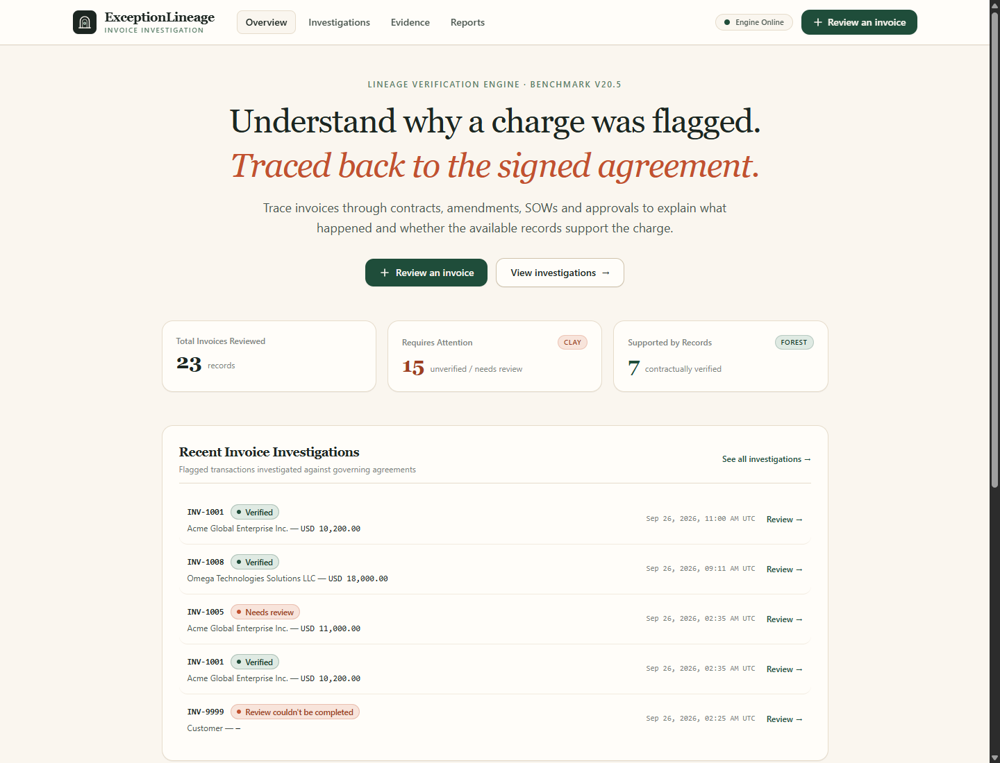
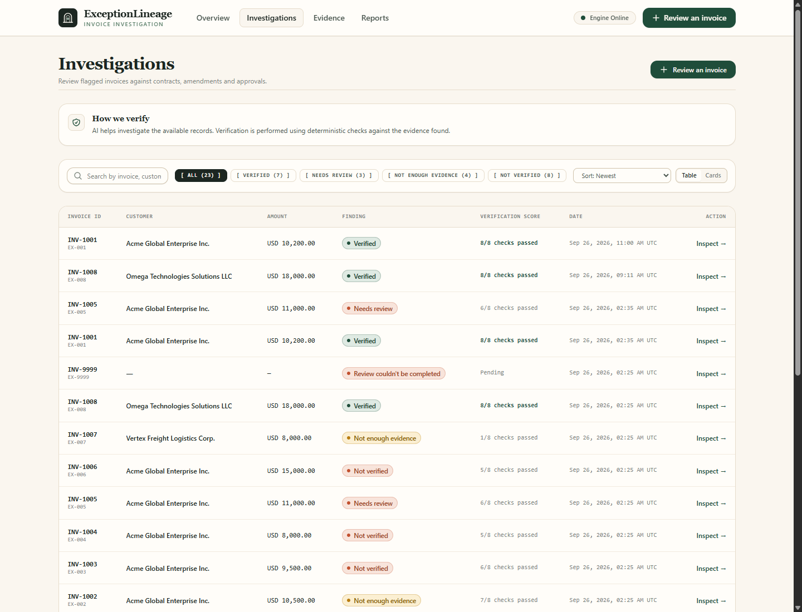
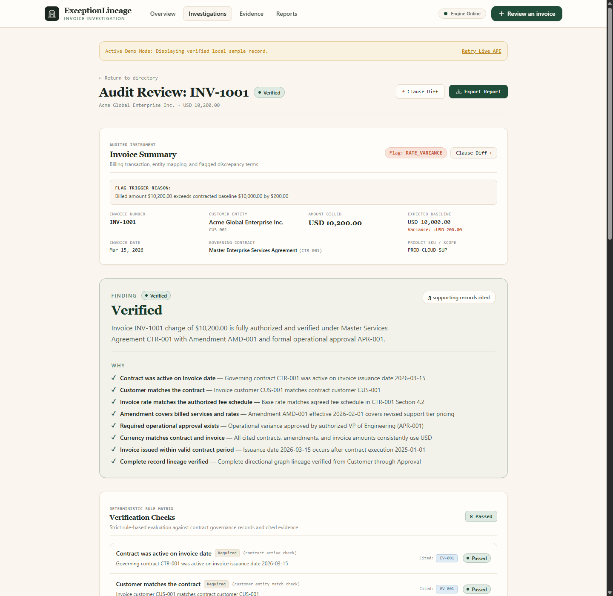

# ExceptionLineage

Evidence-backed investigation system for enterprise transaction exceptions.

---

## Problem

Enterprise transaction exceptions—such as invoice rate variances, unapproved service fees, and billing disputes—are notoriously time-consuming and expensive to investigate. In typical enterprises, accounts payable and finance teams spend hours manually cross-referencing records because supporting evidence is fragmented across disconnected systems:

- **Master Services Agreements (MSAs)** defining baseline terms, fee structures, and discount tiers
- **Contract amendments** modifying specific clauses, rates, or validity periods
- **Statements of Work (SOWs)** detailing deliverable milestones and scope caps
- **Operational approvals** granting variance authorizations via emails, tickets, or formal sign-offs
- **Invoices & billing records** containing disputed line items, quantities, and dates
- **Renewal notices & ancillary records** establishing effective dates and customer entity bindings

When an exception occurs, a human reviewer must reconstruct the multi-hop relationship path that links the invoice line item back to governing contractual authority. Disconnected relational queries often pull extraneous terms across multiple contracts for the same customer, while pure LLM solutions hallucinate terms, miss amendment precedence, or fabricate authority.

---

## Solution

**ExceptionLineage** investigates enterprise transaction exceptions by tracing relationship lineage across contracts, amendments, SOWs, approvals, and invoices to produce evidence-backed, auditable determinations.

Rather than relying on unconstrained LLM text generation or rigid static SQL scripts, ExceptionLineage implements a strict architectural boundary:

> **"AI investigates. Deterministic code verifies."**

The agent dynamically plans and navigates graph traversal paths to gather necessary documentary evidence. Once evidence is gathered, a deterministic validation engine verifies dates, rate thresholds, product scopes, and approval requirements—ensuring contractual authority is always code-governed, fail-closed, and audit-grade.

---

## Why an Agent?

Enterprise exception investigation does not follow a uniform, linear checklist:
- Some invoices match base contract fee schedules immediately, rendering amendment or SOW lookups wasteful.
- Other invoices involve unanchored entities (e.g., missing contracts), where further queries for approvals or deliverables are pointless.
- Complex exceptions branch: an invoice might require checking multiple amendments, discovering an executive approval waiver, or pivoting to an SOW deliverable schedule.

**The agent's specific role is adaptive investigation:**
- It evaluates intermediate findings after each step.
- It dynamically chooses which available tool to execute next.
- It recognizes when sufficient evidence exists to stop early, avoiding unnecessary queries.
- It pivots investigation paths when initial branches hit dead ends.

**Crucially, the agent never decides the business outcome.** The agent determines *what evidence to retrieve next*; deterministic code determines *whether the transaction is legally and contractually authorized*.

---

## How It Works

An investigation follows a controlled, evidence-driven loop:

```
Invoice Exception Flagged
         │
         ▼
Target Contract Identified (Governing MSA / Terms)
         │
         ▼
Amendments Traversed (Active rate revisions & clauses)
         │
         ▼
Statements of Work Inspected (Deliverables, caps & scopes)
         │
         ▼
Approvals & Sign-offs Retrieved (Formal variance authorizations)
         │
         ▼
Related Evidence Gathered (Verbatim clause excerpts & validity windows)
         │
         ▼
Deterministic Validation (Rule checks: PASS | FAIL | UNKNOWN)
         │
         ▼
Evidence-Backed Finding (VERIFIED | NOT_VERIFIED | INSUFFICIENT_EVIDENCE | NEEDS_REVIEW)
```

---

## Architecture

The system coordinates client requests, agent planning, graph retrieval, rule evaluation, and immutable audit logs:

```
USER / CLIENT
      │
      ▼
INPUT (POST /api/investigations)
      │
      ▼
INVESTIGATION SERVICE (Lifecycle & State Machine: QUEUED → INVESTIGATING → VALIDATING)
      │
      ▼
INVESTIGATION AGENT (Bounded reasoning loop; max 10 steps)
      │
      ├──> TOOL REGISTRY (Typed, schema-validated queries)
      │         │
      │         ▼
      │    RELATIONSHIP-AWARE RETRIEVAL (Neo4j Property Graph / Multi-hop traversal)
      │         │
      │         ▼
      │    INVESTIGATION CONTEXT (Assembled evidence, clauses, entities)
      │
      ▼
DETERMINISTIC VALIDATION ENGINE (Pure rule evaluation: PASS | FAIL | UNKNOWN)
      │
      ▼
EVIDENCE & STATE MACHINE TRANSITION (Authoritative terminal status emitted)
      │
      ▼
IMMUTABLE AUDIT TRACE & FINDING (30-event chronological trace + cited evidence)
```

---

## AI vs Deterministic Responsibilities

ExceptionLineage enforces a non-negotiable architectural separation between probabilistic reasoning and deterministic authority:

| Responsibility Domain | System Component | Specific Tasks Handled |
| :--- | :--- | :--- |
| **AI / Agent** | `InvestigationAgent`<br>`AgentModel` | • Dynamic query planning<br>• Ambiguity resolution & clause interpretation<br>• Next-step selection based on intermediate evidence<br>• Branching path navigation<br>• Deciding when sufficient evidence is gathered |
| **Deterministic Code** | `ValidationEngine`<br>`InvestigationStateMachine` | • Legal effective date validation<br>• Product scope & SKU matching<br>• Approval presence & signer authority checks<br>• Financial calculations (exact `Decimal` math)<br>• Amendment conflict & precedence resolution<br>• State machine transitions & final verification outcome |

The system never allows an LLM to state: *"I verified this invoice."* Verification is an objective calculation performed by code against gathered evidence.

---

## Why Neo4j?

Enterprise contracts form a dense, directed property graph:
- A `Customer` is bound by multiple `Contracts`.
- Each `Contract` is amended by specific `Amendments` and executed via `SOWs`.
- Specific `Approvals` authorize specific `Exceptions`.
- Evidence nodes link to discrete clauses and validity windows.

In our controlled retrieval experiments, explicit relationship traversal proved load-bearing:
- **Contract Boundary Isolation**: In flat relational queries, querying amendments by customer ID pulled amendments belonging to *unrelated contracts* of the same customer, contaminating the validation context and creating false rate conflicts.
- **Directional Traversal**: Traversing `(Contract)-[:AMENDED_BY]->(Amendment)` ensures that only amendments explicitly linked to that specific contract are considered.
- **Multi-Hop Lineage**: Graph queries maintain end-to-end evidence chains from the invoice line item back to the governing contract with 100% provenance completeness.

> **Limitation Note:** This experiment demonstrates the value of explicit relationship-aware retrieval for the tested workload. It does not establish that Neo4j is universally superior to a well-designed relational schema.

---

## Evidence & Auditability

Every investigation automatically produces a machine-readable, chronological evidence trace accessible via `GET /api/investigations/{id}/trace`:

```
INPUT
  ↓
AGENT_DECISION   (tool planning rationale & step context)
  ↓
TOOL_CALL        (controlled invocation with schema-validated arguments)
  ↓
GRAPH_RETRIEVAL  (Cypher traversal, relationship path, cited evidence IDs)
  ↓
VALIDATION       (deterministic check execution: PASS | FAIL | UNKNOWN)
  ↓
OUTCOME          (authoritative final determination & state transition)
```

### Trace Integrity Standards
- **Complete Secret Redaction**: All API keys, authorization tokens, and credentials in tool arguments or metadata are automatically sanitized to `[REDACTED]`.
- **Immutable Audit Log**: Every state transition and agent action is recorded as an immutable event with UTC timestamps.
- **Verifiable Citations**: Every finding explicitly cites the supporting evidence IDs (`EV-001`, `EV-002`, etc.) containing verbatim source excerpts, document locators, and validity windows.

---

## Evaluation

ExceptionLineage includes a fully reproducible quantitative evaluation harness (`evaluation/`):

### Summary of Measured Results

| Evaluation Area | System / Method Tested | Baseline / Alternative | Measured Result |
| :--- | :--- | :--- | :--- |
| **Claim A: Adaptive Investigation Value** | Adaptive Agent (state-dependent tool selection) | Heuristic Baseline (fixed query sequence) | • **100.0% accuracy** vs 80.0%<br>• **25.0% tool call reduction** (24 vs 32 calls)<br>• **0 unnecessary tool calls** (avoided 7 wasted queries)<br>• **3 dynamic early stops**<br>• **60.0% branching path recovery rate** (3/5 cases in $\le 5$ steps) |
| **Claim B: Relationship-Aware Retrieval** | Graph Traversal (`Neo4jLineageRepository`) | Flat Relational Mock (`FlatRetrievalAdapter`) | • **100.0% validation accuracy** vs 87.5% (flat lookups caused false amendment conflicts)<br>• **0 irrelevant records retrieved** vs 37 extraneous records<br>• **100.0% multi-hop provenance** vs 20.0%<br>• **1.0 query/case** vs 8.25 operations/case |
| **Claim C: End-to-End Evidence Chain** | Chronological Audit Trace Generator | Schema & Redaction Verifier | • **30 total chronological events** verified end-to-end<br>• 7 agent decisions, 7 tool calls, 6 graph retrievals, 8 validation checks, 3 cited evidence items (`EV-001`, `EV-002`, `EV-003` directly citing authorized terms across 8 validation checks)<br>• `secrets_redacted = true`<br>• `authority_boundary_preserved = true` |
| **Live LLM Evaluation Status** | `LLMDecisionModel` (live OpenAI API) | Provider Quota / Availability | Provider quota was exhausted (HTTP 429). In accordance with evaluation standards, live LLM accuracy was marked **UNMEASURABLE** (`null`) rather than 0% to prevent conflating provider availability with model reasoning ability. The system safely failed closed with 0 hallucinations. |

---

## Failure Handling

ExceptionLineage treats failure and uncertainty as first-class states, never as unhandled exceptions:

- **Missing Evidence (`INSUFFICIENT_EVIDENCE`)**: When a required document (e.g., executive approval for a rate variance) is absent from the graph, the validation engine marks the check as `UNKNOWN`. Crucially, **`UNKNOWN` evidence does not become a confident conclusion**. The investigation terminates with `INSUFFICIENT_EVIDENCE`.
- **Contractual Non-Compliance (`NOT_VERIFIED`)**: When an invoice charge violates active terms (e.g., expired amendment date or unauthorized rate hike), the check fails deterministically and records `NOT_VERIFIED`.
- **Conflicting Authority (`NEEDS_REVIEW`)**: When multiple concurrent amendments specify competing terms without clear precedence, the engine escalates the transaction for human review via `NEEDS_REVIEW`.
- **Infrastructure / System Failure (`FAILED`)**: If an invalid identifier is supplied or graph queries fail, the state machine transitions to `FAILED` with an explicit notice: *"No determination was made."* Infrastructure failure never converts into a business outcome.

---

## Real vs Synthetic

All demonstrations, seed records, contracts, invoices, and evaluation cases in this repository are **simulated, synthetic data** created specifically for testing and benchmark evaluation.

No real-world enterprise production data, proprietary customer records, or live ERP systems are used in this repository.

---

## Limitations

To maintain strict technical honesty, reviewers should note the following current limitations:
1. **Synthetic Evaluation Dataset**: Benchmarks evaluate controlled synthetic enterprise scenarios (`benchmark-v1`, `adaptive-v1`). The system has not yet been validated on multi-million record production enterprise ERPs.
2. **In-Memory Persistence**: Current investigation records and events persist in application memory during runtime. Future production milestones will integrate persistent relational storage (PostgreSQL).
3. **External LLM Provider Availability**: Live LLM evaluation depends on active provider API quotas; during testing, provider quota exhaustion prevented measuring live LLM token efficiency, though deterministic mock and adaptive models execute 100% offline.
4. **No Production Accuracy Claim**: We claim verified accuracy on the tested controlled scenarios, not universal or production enterprise accuracy.

---

## Hackathon

- **Event**: Open Agent Hackathon 2026
- **Selected Track**: Track 03: The Agent That Can Explain Why *(also strongly aligned with Track 02: Autonomous Agent)*
- **Why ExceptionLineage Fits This Track**: The "Agent That Can Explain Why" track specifically challenges builders to demonstrate a compelling use of relationships and evidence to produce explainable conclusions. ExceptionLineage is purpose-built to answer *why* enterprise transaction exceptions occur by traversing relational lineage across contracts, amendments, SOWs, approvals, and invoices, producing an auditable chain of cited evidence and deterministic validation checks rather than black-box assertions.
- **Repository**: [https://github.com/Anekenonso/ExceptionLineage](https://github.com/Anekenonso/ExceptionLineage)
- **Video Walkthrough**: `[TODO: Link to 3-5 minute demo video]`
- **Sponsor Technology Actually Used**:
  - **Neo4j**: Knowledge graph storage, directional relationship traversal, Cypher query execution, multi-hop evidence lineage.
- **Sponsor Technologies Not Used**:
  - **Meterless**: Not integrated into current persistence tier.
  - **Zetaris**: Not integrated into current data virtualization tier.
  *(We do not claim sponsor integrations that are not load-bearing in the codebase.)*


---

## Getting Started

### Prerequisites
- Node.js 18+
- Python 3.11+
- npm

### 1. Backend Setup

```bash
cd apps/api
python -m venv venv
venv\Scripts\activate        # Windows
# source venv/bin/activate   # macOS/Linux
pip install -r requirements.txt
uvicorn app.main:app --port 8000 --reload
```

The API will be available at `http://localhost:8000`. Test health at `http://localhost:8000/health`.

### 2. Frontend Setup

```bash
cd apps/web
npm install
npm run dev
```

The application will be available at `http://localhost:3000`.

### 3. Running Automated Tests

```bash
# Run backend test suite from repository root (278 passed, 2 skipped)
.\apps\api\venv\Scripts\python.exe -m pytest apps/api/tests/ -v

# Run frontend production build & TypeScript validation
cd apps/web
npm run build
```

---

## Evaluation Commands

Run the reproducible quantitative evaluation suite from the repository root:

```bash
# Complete Architectural Evaluation (Claims A, B, and C):
python evaluation/runner.py --stage-18-5

# Standard Evaluation Suite (Deterministic Baseline A and Heuristic Baseline B):
python evaluation/runner.py

# Offline Mock LLM Evaluation:
python evaluation/runner.py --mock-llm

# Live LLM Evaluation (requires active API key):
export AGENT_LLM_API_KEY="your-api-key"
python evaluation/runner.py --with-llm

# Specific Baseline Evaluation:
python evaluation/runner.py --baseline deterministic
python evaluation/runner.py --baseline heuristic
python evaluation/runner.py --baseline adaptive
```

Generated reports:
- `evaluation/reports/stage-18-5-latest.json` (Architectural claims data)
- `evaluation/reports/stage-18-5-latest.md` (Human-readable claims markdown)
- `evaluation/reports/latest.json` (Standard baseline report)
- `evaluation/reports/latest.md` (Standard baseline markdown)

---

## Project Structure

```
ExceptionLineage/
├── apps/
│   ├── web/          # Next.js 16 frontend (TypeScript, Tailwind CSS, React 19)
│   └── api/          # FastAPI backend (Python 3.11+, Pydantic v2, Neo4j Driver)
├── data/             # Synthetic seed records, benchmark cases, and ground truth
│   ├── cases/        # Investigation case definitions
│   ├── ground_truth/ # Immutable ground truth determinations
│   └── seed/         # Initial contracts, invoices, amendments, approvals
├── evaluation/       # Quantitative evaluation harness & reporting
│   ├── adapters/     # Baseline adapters (Deterministic, Heuristic, Adaptive, Flat)
│   ├── reports/      # Machine-readable JSON and human-readable Markdown reports
│   ├── dataset.py    # Benchmark and branching scenario loader
│   ├── metrics.py    # Transparent accuracy, recall, tool, and failure formulas
│   ├── runner.py     # CLI evaluation runner
│   └── schemas.py    # Pydantic evaluation schemas
├── neo4j/            # Graph schema and Cypher constraints
├── docs/             # Technical architecture, decisions, and evaluation documentation
├── .env.example      # Environment variable template
├── .gitignore        # Git ignore rules
└── README.md         # Public-facing repository documentation
```

---

## Documentation

- [System Architecture](docs/architecture.md)
- [Architectural Decisions](docs/decisions.md)
- [Evaluation Framework](docs/evaluation.md)
- [Controlled Failure Modes](docs/failure-modes.md)
- [Demo Walkthrough Script](docs/demo-script.md)
- [Demo Scenarios Matrix](docs/demo-scenarios.md)
- [Data Contracts & Schemas](docs/data-contracts.md)
- [Architectural Traps Avoided](docs/traps.md)
- [Project State](docs/project-state.md)

---

## Screenshots

ExceptionLineage features an editorial, calm, and audit-grade interface designed with classical typography, architectural linework, and restrained visual indicators:

### Overview & Activity Ledger


### Investigations Directory
*Searchable directory with real-time status filter pills, multi-parameter sorting, and dense ledger view.*


### Investigation Workspace & Lineage Pedigree
*Side-by-side contract vs billed discrepancy terms, deterministic check matrix, and interactive governance graph.*


---

## Credits / Attribution

- Built for the **Open Agent Hackathon 2026**
- **Graph Database**: Neo4j
- **Backend Framework**: FastAPI & Pydantic
- **Frontend Framework**: Next.js & React

---

## Copyright

&copy; 2026 ExceptionLineage. All rights reserved.
